<div align="center">

# procedural-art

**Real mountains, glass and paintings made with code and real elevation data. No image model.**

Two Claude skills. Name any mountain on Earth and get an engraving, a woodcut, a photograph, or a painting of it.

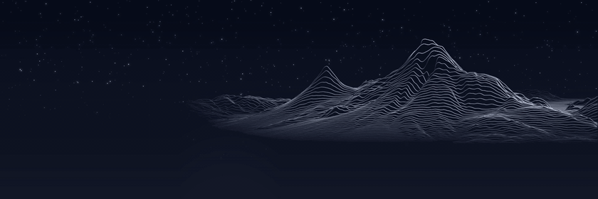

[](https://github.com/dogum/procedural-art/actions/workflows/ci.yml)
[](https://github.com/dogum/procedural-art/releases/latest)
[](LICENSE)
[](#install)

**[Showcase](https://dogum.github.io/procedural-art/)** · **[Studios in your browser](https://dogum.github.io/procedural-art/#studios)** · **[Latest release](https://github.com/dogum/procedural-art/releases/latest)** · **[Changelog](CHANGELOG.md)**

</div>

---

It started as an attempt to recreate an AI-generated header of Mount Ararat with math instead of a model, drawn from the real mountain's elevation. From there it grew into two skills:

| Skill | What it makes |
|---|---|
| **[procedural-terrain-art](skills/procedural-terrain-art)** | Any real mountain, range, canyon or island in six print styles, looping orbit videos, and a self-contained interactive studio page. |
| **[procedural-realism](skills/procedural-realism)** | Photographic terrain (sky, haze, snow, lakes, forests, city lights, sun timelapses), a path tracer for glass and metal still lifes, and a painterly finisher for any image. |

Every terrain pixel comes from SRTM-derived elevation, numpy and physics. Nothing is downloaded except elevation tiles, and no generative model is involved at any step.

## One mountain, six prints

Masis and Sis (Ararat) seen from Yerevan. Same elevation grid, same hidden-line buffer, six ways of drawing it.

<table>
<tr>
<td width="33%">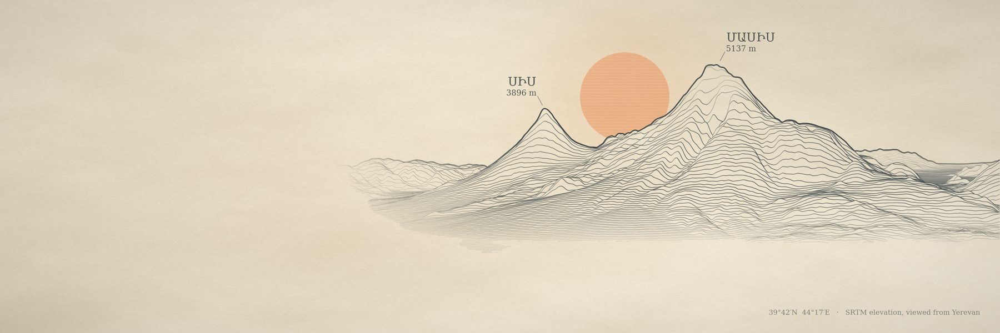<br><code>survey</code></td>
<td width="33%">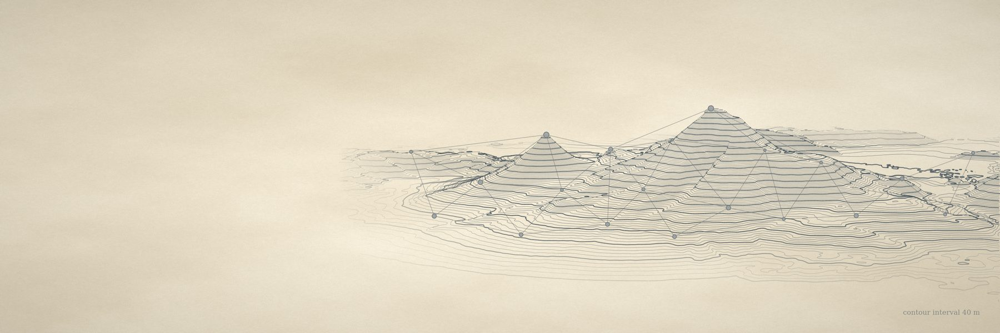<br><code>topo</code></td>
<td width="33%">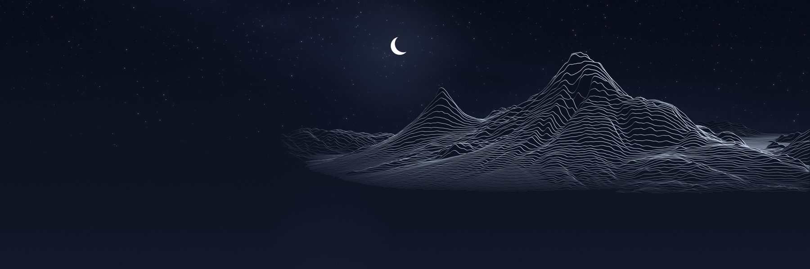<br><code>nocturne</code></td>
</tr>
<tr>
<td width="33%">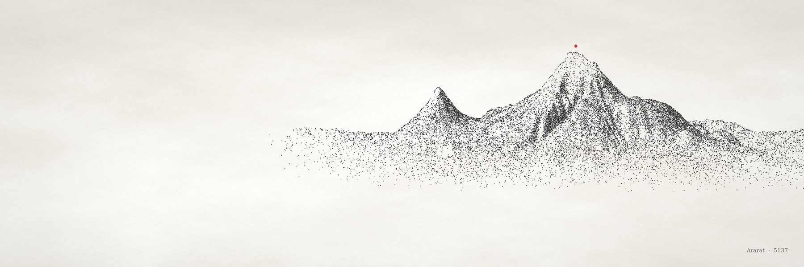<br><code>stipple</code></td>
<td width="33%">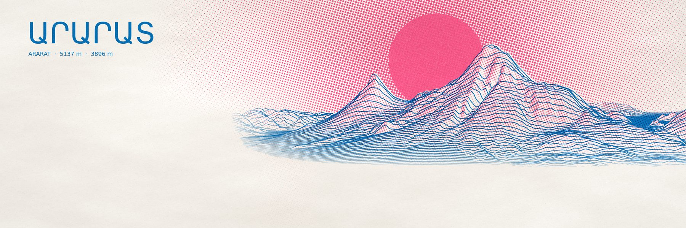<br><code>riso</code></td>
<td width="33%">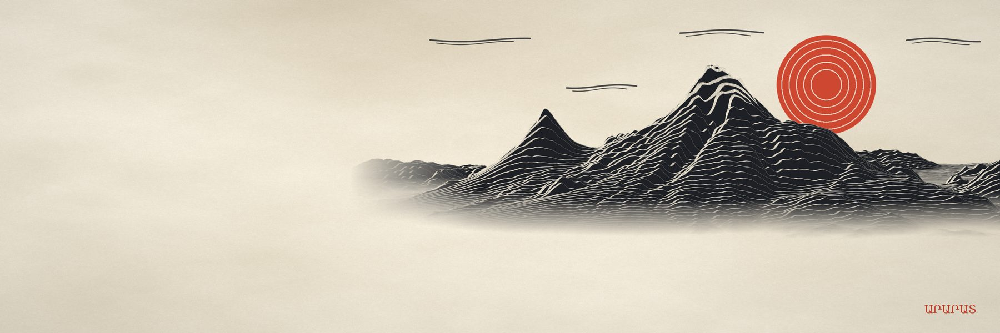<br><code>woodcut</code></td>
</tr>
</table>

## Any landform

The engine measures the ground around the summit before it frames anything: how steep the peak is for its footprint, what stands in front of it, how rough it is, whether it sits below a plateau. Cone volcanoes keep the original framing; horns, ranges, canyons and islands get their own.

<table>
<tr>
<td width="33%">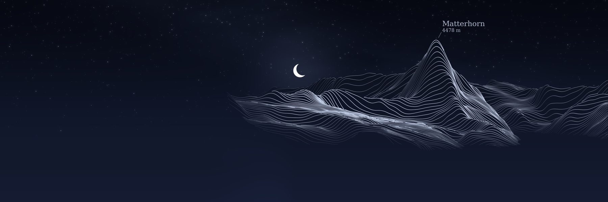<br>Matterhorn · horn</td>
<td width="33%">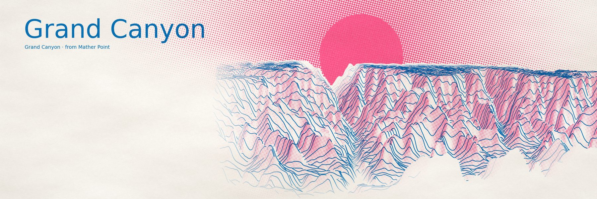<br>Grand Canyon · canyon</td>
<td width="33%">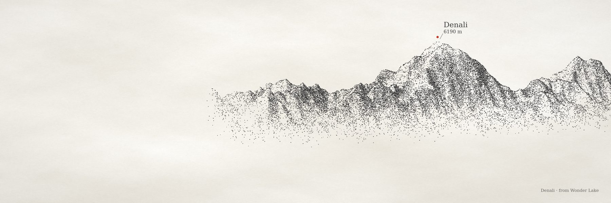<br>Denali · massif</td>
</tr>
<tr>
<td width="33%">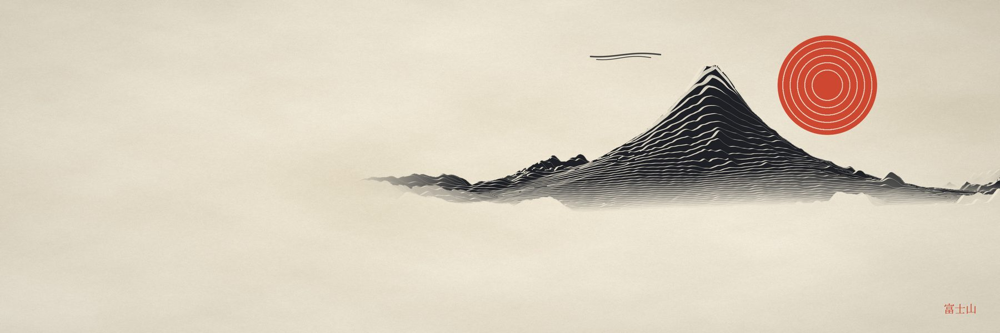<br>Fuji · cone</td>
<td width="33%">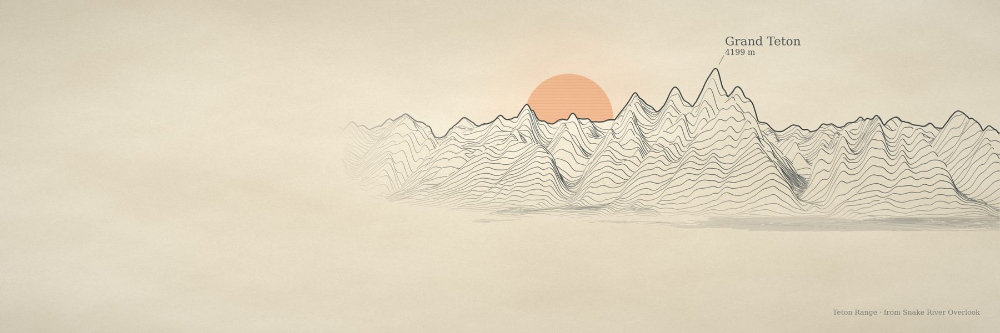<br>Tetons · range</td>
<td width="33%">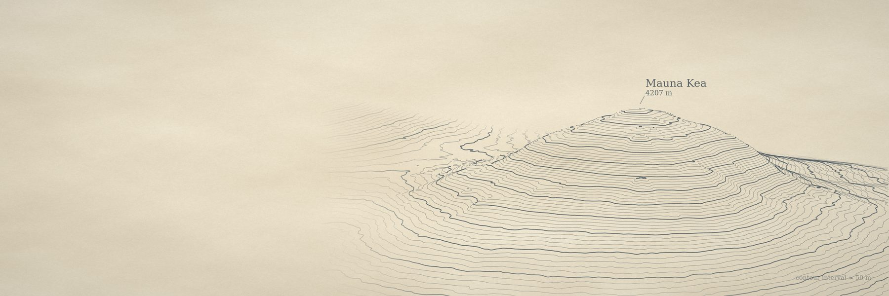<br>Mauna Kea · island volcano</td>
</tr>
</table>

<details>
<summary>Before and after: the Matterhorn</summary>

The first engine treated every mountain like Ararat, and the Matterhorn drowned in its own massif (top). Landform-aware framing raises the base from 1429 m to 2441 m and narrows the scene's half-width from 30.7 km to 10.8 km (bottom). Fuji, Ararat and Mauna Kea render identically before and after.

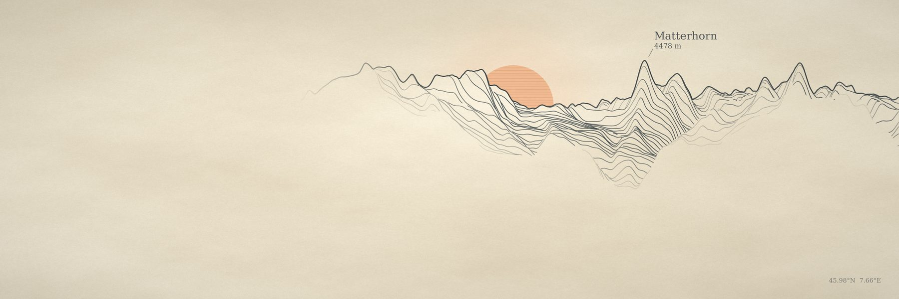
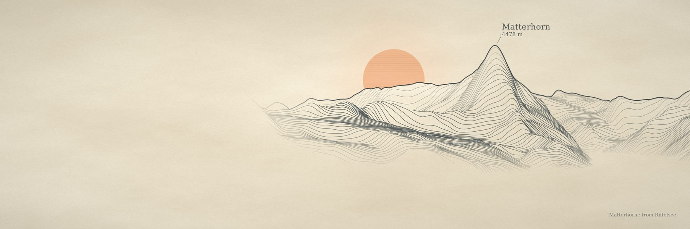
</details>

## Toward a photograph

The same elevation, ray-marched through a physical atmosphere: Rayleigh and Mie scattering, soft terrain shadows, valley mist, a lenticular cloud with multiple scattering. Lakes reflect the terrain with Fresnel and ripple normals. Trees, villages and city lights are placed near the camera.

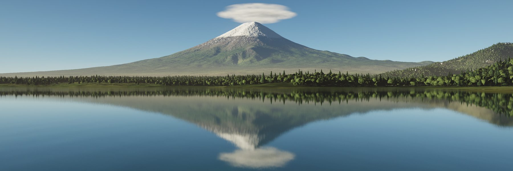

<table>
<tr>
<td width="50%">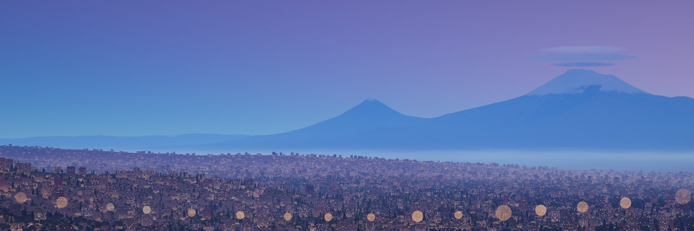<br>Blue hour over Yerevan, with lens bokeh</td>
<td width="50%">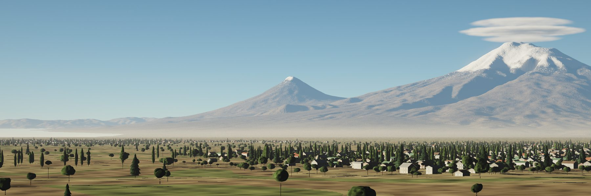<br>Orchards, poplars and villages</td>
</tr>
</table>

There's also a [sunset timelapse](https://dogum.github.io/procedural-art/media/timelapse.mp4) along the real sun path for a date and place, from golden hour into night.

## Glass, from scratch

A Monte Carlo path tracer in plain numpy. Scenes are small JSON files: spheres, boxes, prisms, cut gems, hollow glasses with liquid in them. Multiple importance sampling and adaptive sampling make glass converge about 6.7× faster and copper 12× faster than a plain sampler.

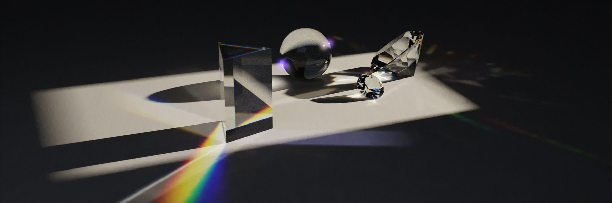

<table>
<tr>
<td width="50%">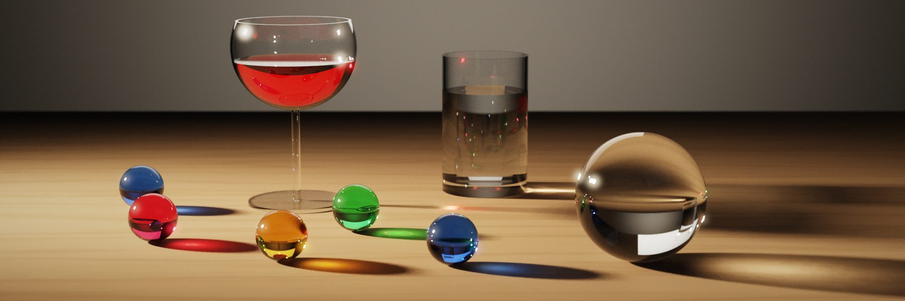<br>Wine and marbles</td>
<td width="50%">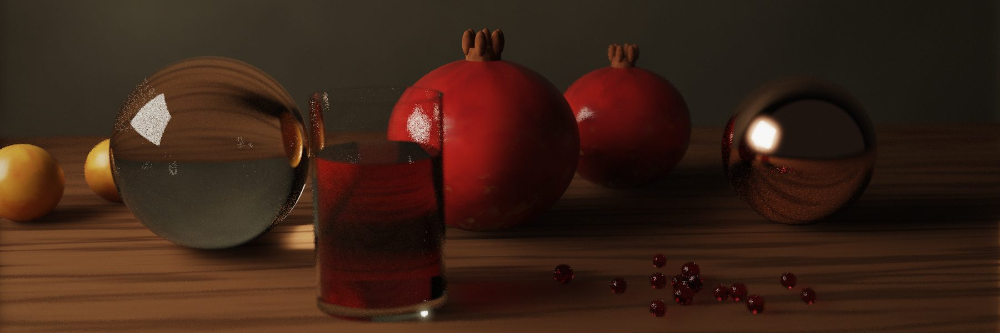<br>Pomegranates</td>
</tr>
</table>

## Then paint it

`paint.py` turns any image into oil, impasto, gouache, watercolour or ink, including a photo you give it. Brushes follow the contours of the picture; watercolour is built from transparent washes with wet edges and granulation.

<table>
<tr>
<td width="50%">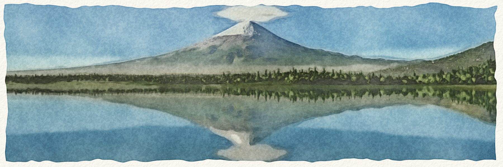<br><code>--style watercolor</code></td>
<td width="50%">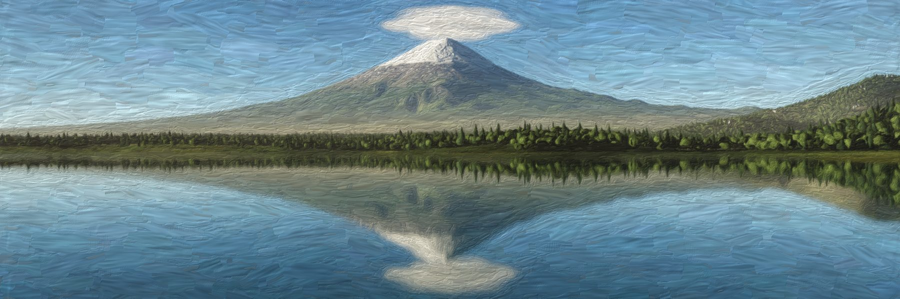<br><code>--style oil</code></td>
</tr>
</table>

## Install

### Claude Code (recommended)

```
/plugin marketplace add dogum/procedural-art
/plugin install procedural-art@procedural-art
```

Both skills install together. Updates arrive with `/plugin update`.

### Claude.ai, Cowork, cloud sessions

1. Download `procedural-terrain-art.skill` and `procedural-realism.skill` from the [latest release](https://github.com/dogum/procedural-art/releases/latest).
2. Open Claude.ai → Settings → Capabilities → Skills.
3. Upload each file. Re-upload to update.

### Manual, or any Agent Skills runtime

```bash
git clone https://github.com/dogum/procedural-art.git
mkdir -p ~/.claude/skills
cp -r procedural-art/skills/procedural-terrain-art procedural-art/skills/procedural-realism ~/.claude/skills/
pip install -r procedural-art/requirements.txt
```

**Requirements:** Python 3 with numpy, scipy, pillow, matplotlib and contourpy (`requirements.txt`); ffmpeg for videos; network access to AWS Terrain Tiles for elevation (no key). Everything runs on CPU.

## Try these

Once installed, just ask. The skills look up the summit and a real viewpoint, fetch the elevation, render a small draft, look at it, then render the final.

- *"Make me an X header of Mount Rainier from Seattle in the engraved-line style."*
- *"LinkedIn banner of the Grand Tetons as a black woodcut, big TETONS title."*
- *"Show me Denali in every style so I can pick one."*
- *"A 6-second looping orbit of the Matterhorn at night."*
- *"Build me an interactive page to play with Mount Hood from Portland."*
- *"Mont Blanc reflected in Lac Blanc at golden hour, photographic, no image model."*
- *"Sunset timelapse of Kilimanjaro from Amboseli, into the night."*
- *"A glass of whiskey with two ice cubes on walnut, window light. No Blender."*
- *"Turn this photo into a watercolour."*

Or run the scripts yourself. From any writable folder, with `SK` pointing at the installed skill:

```bash
SK=~/.claude/skills/procedural-terrain-art
python $SK/scripts/render.py --peak 46.8523,-121.7603 --from 47.6062,-122.3321 \
  --style survey --size 3000x1000 --label "Mount Rainier|4392 m" --out rainier.png
```

That exact command, unedited, on a mountain none of the tests use (15 s):

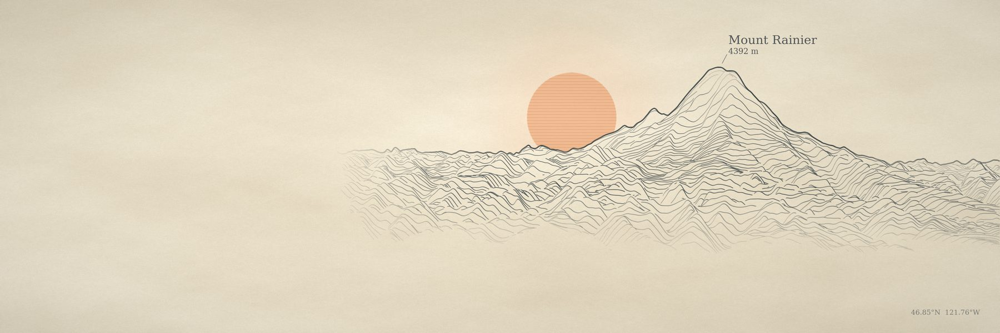

Each `SKILL.md` has the full workflow, and `references/` covers the engine, scene format, terrain features and painting presets.

## Studios in your browser

`build_studio.py` writes one HTML file (about 0.76 MB) with a 512 × 512 elevation grid inside. Orbit the mountain, move the light, change the ink, and save a 3000 × 1000 PNG. No server and no libraries; the only network request is for web fonts. Five are live on the site: [Ararat](https://dogum.github.io/procedural-art/studio/ararat.html), [Fuji](https://dogum.github.io/procedural-art/studio/fuji.html), [Matterhorn](https://dogum.github.io/procedural-art/studio/matterhorn.html), [Denali](https://dogum.github.io/procedural-art/studio/denali.html) and the [Grand Canyon](https://dogum.github.io/procedural-art/studio/grand-canyon.html). The same pages work as claude.ai artifacts, where the Save button uses the artifact download capability: see the [Ararat studio](https://claude.ai/artifact/2nyskwgoMR3ieJoZP3n1Dk) and the [showcase](https://claude.ai/artifact/XqYinY4hfHVU6PdxYz3548) on claude.ai.

## How it works

**Prints.** Elevation tiles become a grid aligned with the camera, rows running away from the viewer. Rows are projected near to far with a perspective camera, and a floating horizon per pixel column hides anything behind what's already drawn. A G-buffer records which row owns each pixel, so every style can sample height, shade and snow per pixel. Everything is normalised to a reference mountain, so a 1 km hill and an 8 km giant both fill the frame without retuning. [Engine notes](skills/procedural-terrain-art/references/engine.md).

**Photographs.** Each pixel's ray marches a 40 m heightfield (with Earth curvature) until it hits ground, then asks the sky how much light reaches that point and how much air lies between it and the camera. Near-field instances (water, trees, houses, lights) are traced separately. Renders run in resumable row bands. [Terrain features](skills/procedural-realism/references/terrain_features.md) · [What we learned](skills/procedural-realism/references/lessons.md).

**Glass.** Unidirectional path tracing with next-event estimation, MIS, Russian roulette, Fresnel and Beer-Lambert absorption, spectral dispersion, and an adaptive sampler that spends samples where noise is high. [Scene format](skills/procedural-realism/references/scenes.md).

## Performance

One CPU core:

| Output | Time |
|---|---|
| Print style, 3000 × 1000 | 5–15 s |
| All six styles + contact sheet | ~40 s |
| Studio page | ~5 s to build |
| Photographic terrain, 3000 × 1000 | 3–12 min (resumable) |
| Timelapse, 40 keyframes at 1200 × 400 | ~40 min (resumable) |
| Clean still life, 2400 × 800 | ~1 hour (resumable) |
| Painting, 3000 × 1000 | 10–60 s |

## Limits

What works and what doesn't: light, atmosphere, glass, metal and real terrain at a distance look right. Trees and houses look game-like closer than about 300 m; city lights are boxes and window grids at 1:1; timelapse in-betweens cross-fade shadows instead of sliding them; paintings soften fine detail on noisy sources; organic shapes like petals are out of reach for the path tracer. The skills say so when a request lands there.

## Repository layout

```
.claude-plugin/               plugin.json and marketplace.json (Claude Code)
skills/
  procedural-terrain-art/     SKILL.md, scripts/, references/, assets/studio_template.html, evals/
  procedural-realism/         SKILL.md, scripts/, references/, scenes/*.json, evals/
evals/                        claude plugin eval cases (should-trigger, should-not-trigger)
docs/                         GitHub Pages: the showcase, five studios, media
scripts/                      build-skills.sh (the Claude.ai packages), regression_terrain.py
```

Both skills ship the same `scripts/dem.py`; the build refuses to package them if the copies differ.

## Evals

```bash
claude plugin eval . --allow-tools Write Bash
```

Four should-trigger cases render real drafts and have an LLM judge look at the PNG; four should-not-trigger cases (Blender settings, a Midjourney prompt, a QGIS how-to, a plain fact) assert neither skill fires. Each skill also carries skill-creator evals. See [evals/README.md](evals/README.md).

## Contributing

Pictures welcome. See [CONTRIBUTING.md](CONTRIBUTING.md): change a skill, render a small before/after, run `scripts/build-skills.sh`, and if you touched the terrain engine, run the regression sheet. Made something with the skills you're proud of? Open an issue with the image and the prompt.

## Credits

Elevation data: [Terrain Tiles on AWS](https://registry.opendata.aws/terrain-tiles/) (SRTM, GMTED, ETOPO1 and other public sources; see the [attribution list](https://github.com/tilezen/joerd/blob/master/docs/attribution.md)). Summit and viewpoint coordinates were looked up from public sources for each example. Built with Claude.

## License

[Apache 2.0](LICENSE).
